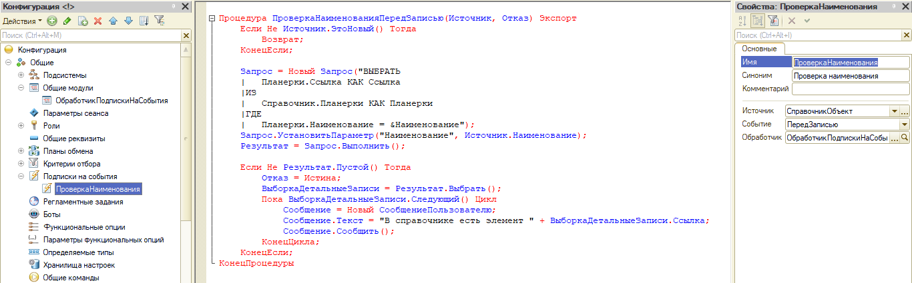

## Подписка на событие (проверка дублирования наименования перед записью для справочника планерок)




```bsl
Процедура ПроверкаНаименованияПередЗаписью(Источник, Отказ) Экспорт
	Если Не Источник.ЭтоНовый() Тогда
		Возврат;
	КонецЕсли;
	
	Запрос = Новый Запрос("ВЫБРАТЬ
	|	Планерки.Ссылка КАК Ссылка
	|ИЗ
	|	Справочник.Планерки КАК Планерки
	|ГДЕ
	|	Планерки.Наименование = &Наименование");
	Запрос.УстановитьПараметр("Наименование", Источник.Наименование);
	Результат = Запрос.Выполнить();                                             
	
	Если Не Результат.Пустой() Тогда
		Отказ = Истина;
		ВыборкаДетальныеЗаписи = Результат.Выбрать();
		Пока ВыборкаДетальныеЗаписи.Следующий() Цикл
			Сообщение = Новый СообщениеПользователю;
			Сообщение.Текст = "В справочнике есть элемент " + ВыборкаДетальныеЗаписи.Ссылка;
			Сообщение.Сообщить();		
		КонецЦикла;
	КонецЕсли;
КонецПроцедуры
```